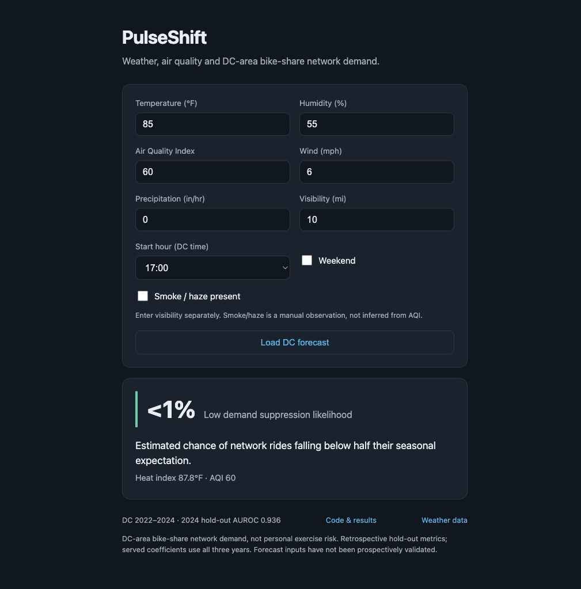
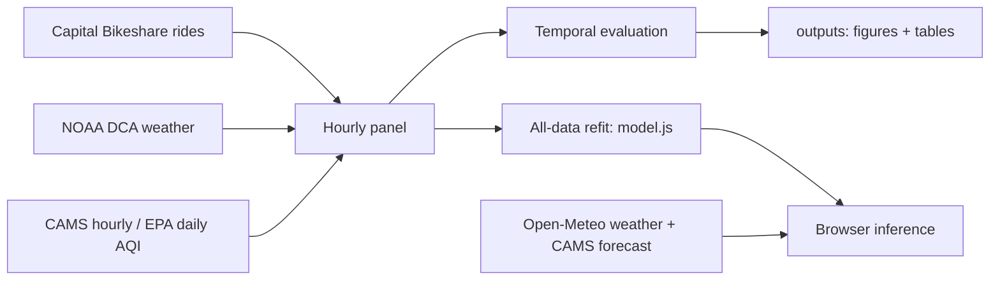
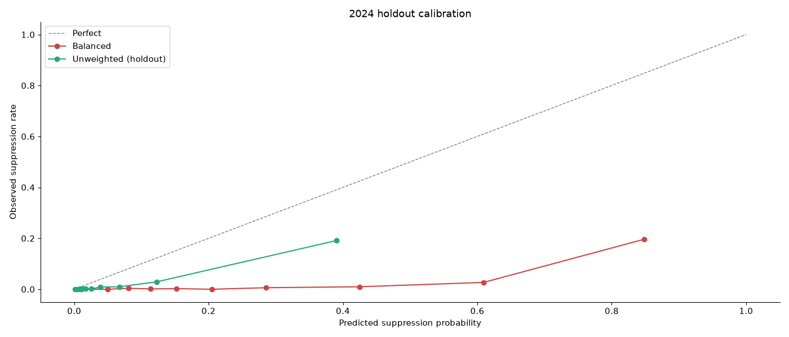
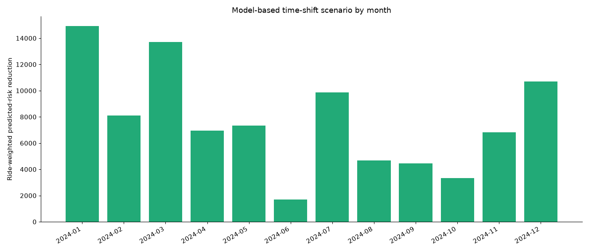
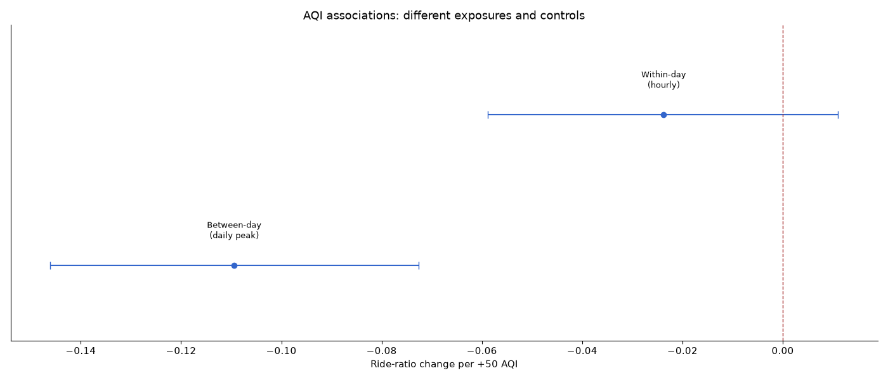
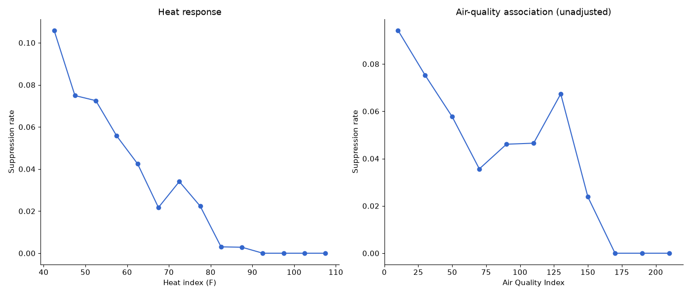
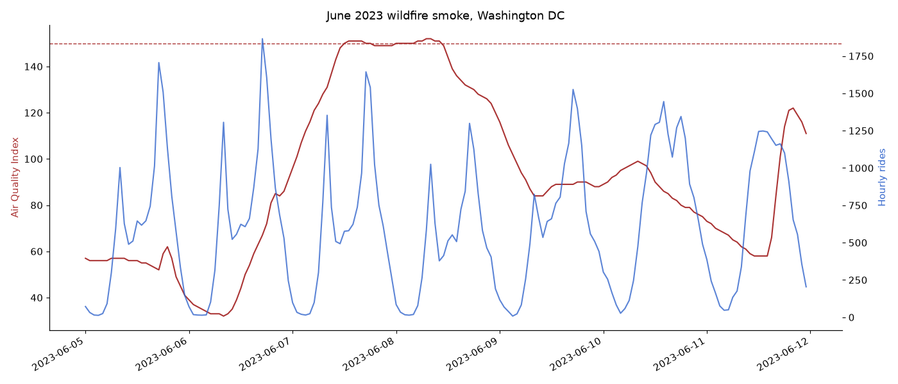
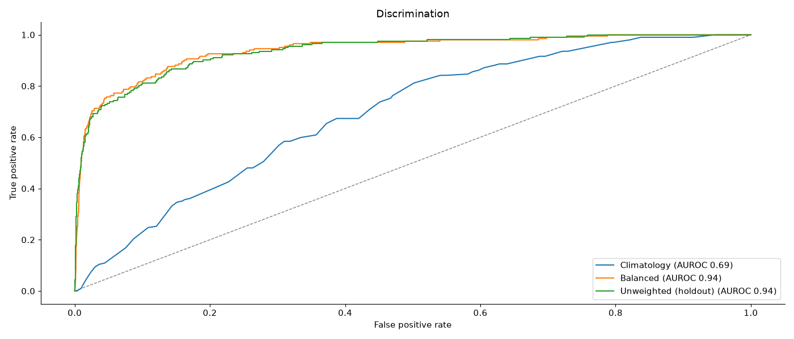
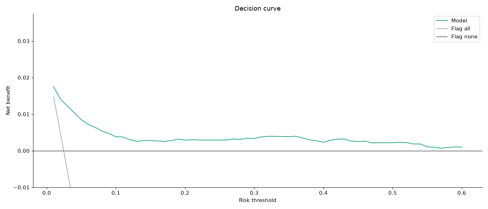

# PulseShift

**Weather, air quality and DC-area bike-share demand.**

[Live demo](https://urmeo.github.io/PulseShift/) · [Results](outputs/tables/) · [Reproduce](CONTRIBUTING.md)

## Overview

Estimates when hourly Capital Bikeshare network rides fall below **50% of seasonal demand**. A 12-feature logistic model runs in the browser and ranks daytime forecast hours below the study's heat and AQI thresholds.

## Data flow

## Results

**2022–23 training: 16,150 hours → 2024 holdout: 8,204 hours.**

| Model | AUROC ↑ | Average precision ↑ | Brier ↓ | Calibration error ↓ |
| --- | ---: | ---: | ---: | ---: |
| Climatology | 0.692 | 0.046 | 0.027 | 0.053 |
| **Unweighted logistic** | **0.936** | **0.488** | **0.021** | **0.044** |
| Balanced logistic | 0.940 | 0.448 | 0.128 | 0.253 |
| Balanced + isotonic | 0.940 | 0.466 | 0.029 | 0.064 |
| Gradient boosting | 0.942 | 0.526 | 0.025 | 0.046 |

Unweighted model, **95% day-bootstrap intervals**: AUROC **0.900–0.967**; average precision **0.319–0.638**; Brier **0.017–0.026**.

**Calibration matters:** mean predicted suppression **6.88%**, observed **2.46%**. The browser coefficients are refit on all 24,354 active hours; the table reports separate holdout models.

| Additional check | Result |
| --- | --- |
| Seoul, independent city refit | AUROC **0.873** · AP **0.694** · Brier **0.064** |
| Seoul date blocks | **6,305** train / **2,160** test hours; latest 25% of dates within each season |
| AQI after weather | AUROC **0.936475 → 0.936477**; AP and Brier slightly worse |
| Shifting by ≤3 hours | **1,126** shifts · **9** cancellations · **0** threshold violations |
| Predicted recovery, full-transfer scenario | **36.8%** (95% CI **33.0–40.9%**) |
| Assumed 50% transfer efficiency | **18.4%**; no observed recovery claim |

More research figures

AQI associations use different exposures and controls; their difference does not establish causality or isolate measurement error.

## Protocol & provenance

1. **Target:** rides <0.5× training-only season × daytype × hour climatology; expected demand ≥20 rides.
2. **Inputs:** 26,288 network-hours, 2022–24; DCA weather, CAMS AQI (80.3% hourly coverage), EPA daily fallback; 16 calendar hours absent.
3. **Artifacts:** raw predictions, source/runtime hashes and panel checksum in [outputs](outputs/tables/); Seoul uses separate coefficients and whole-date blocks.

## Tech stack

| Layer | Tools |
| --- | --- |
| Browser | HTML, CSS, JavaScript; no runtime packages |
| Model | scikit-learn; 12 inputs, sigmoid inference |
| Research | Python 3.12–3.14, NumPy, pandas, SciPy, Matplotlib |
| Forecast | Open-Meteo weather and CAMS US AQI |

## Limitations

1. **Scope:** regional bike-share demand; individual activity and health outcomes are unmeasured.
2. **Validation:** historical-condition holdout; live forecast errors and actual benefits of shifting rides remain untested.
3. **Exposure:** coarse CAMS AQI and daily fallback; incomplete hours, temporal drift and observational confounding limit inference.

## Ethics & data use

Use aggregate public data under each provider's terms. Heat index **≥103°F** or AQI **≥150** blocks a forecast recommendation; missing exposures are excluded. These study thresholds do not replace official advisories.

## References

1. Van Calster et al. *Calibration: the Achilles heel of predictive analytics.* BMC Medicine, 2019. [DOI](https://doi.org/10.1186/s12916-019-1466-7)
2. Saito & Rehmsmeier. *The precision-recall plot is more informative than the ROC plot when evaluating binary classifiers on imbalanced datasets.* PLOS ONE, 2015. [DOI](https://doi.org/10.1371/journal.pone.0118432)
3. Vickers & Elkin. *Decision curve analysis: a novel method for evaluating prediction models.* Medical Decision Making, 2006. [DOI](https://doi.org/10.1177/0272989X06295361)
4. *Seoul Bike Sharing Demand.* UCI dataset, 2020. [DOI](https://doi.org/10.24432/C5F62R)

[MIT license](LICENSE)
